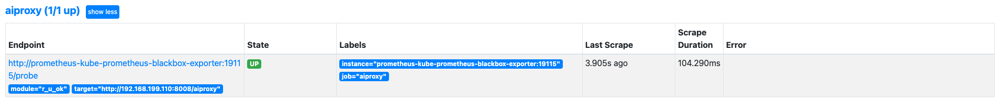
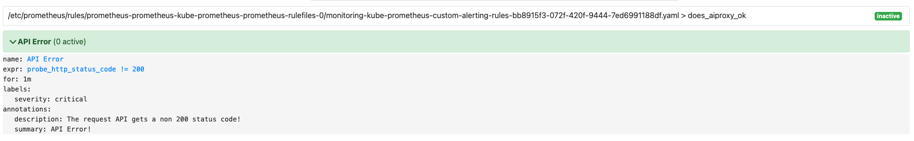
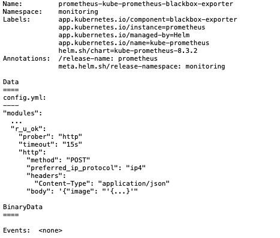
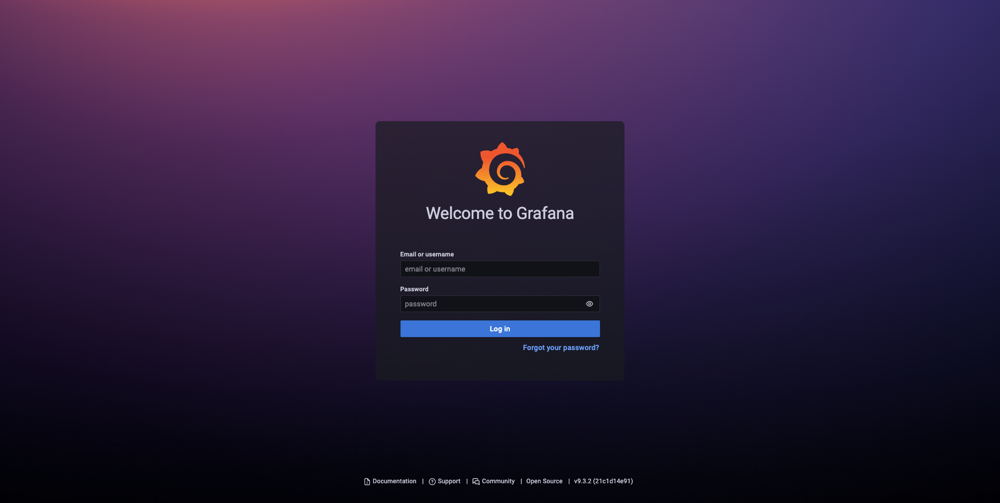
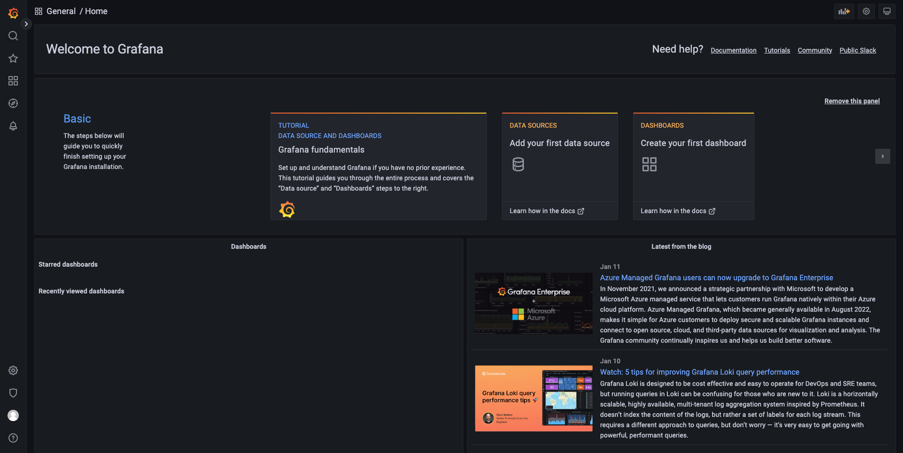
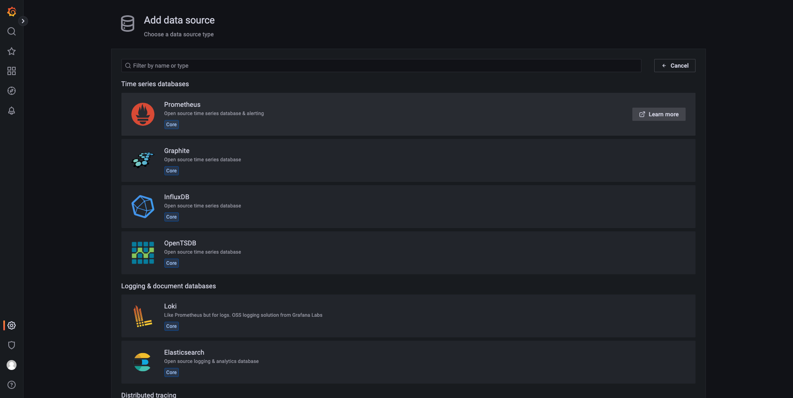
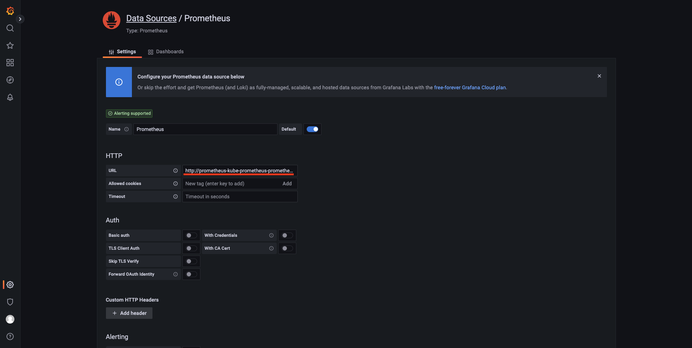
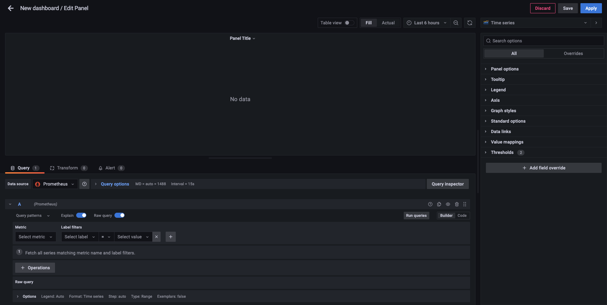
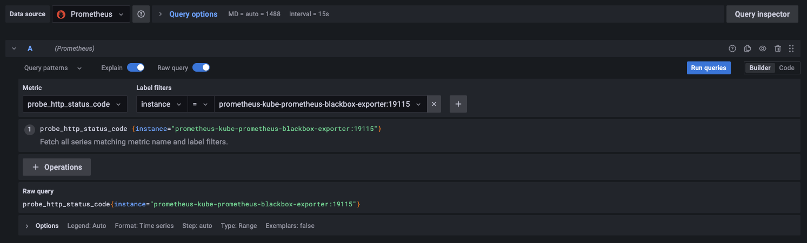
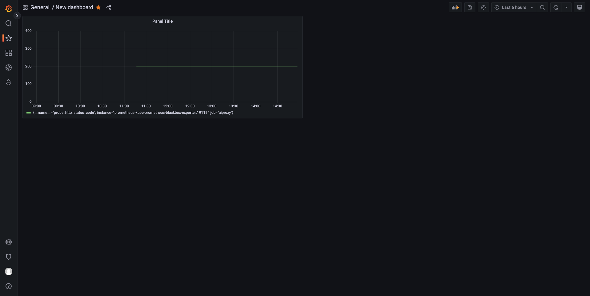

# Kubernetes 下使用 Helm 部署 Prometheus 和 Grafana 进行监测接口并告警

- [前期准备](#前期准备)
- [Prometheus 和 Grafana 的介绍](#prometheus-和-grafana-的介绍)
  - [Prometheus](#prometheus)
  - [Grafana](#grafana)
- [目标](#目标)
- [环境准备](#环境准备)
- [配置 kube-prometheus](#配置-kube-prometheus)
  - [配置 blackbox exporter](#配置-blackbox-exporter)
  - [配置 Prometheus](#配置-prometheus)
- [配置 grafana](#配置-grafana)
- [部署 kube-prometheus](#部署-kube-prometheus)
  - [坑点 \*](#坑点-)
  - [部署](#部署)
- [部署 grafana](#部署-grafana)
- [Grafana DashBoard 配置](#grafana-dashboard-配置)
- [Q\&A](#qa)
- [TODO](#todo)
- [参考](#参考)

## 前期准备

- 阅读本教程确保您了解 Kubernetes 的一些基础概念
- 了解 YAML 语法

如您在配置时有疑惑可以参考 example 目录下的例子
prometheus.yaml 文件为 kube-prometheus 文件夹下的 values.yaml
grafana.yaml 文件为 grafana 文件夹下的 values.yaml

## Prometheus 和 Grafana 的介绍

### Prometheus

#### 什么是 Prometheus ?

Prometheus 是一个开源系统监控和警报工具包，最初由 SoundCloud 构建。自 2012 年启动以来，许多公司和组织都采用了 Prometheus，该项目拥有非常活跃的开发者和用户社区。它现在是一个独立的开源项目，独立于任何公司进行维护。为了强调这一点，并明确项目的治理结构，Prometheus 于 2016 年作为继 Kubernetes 之后的第二个托管项目加入了云原生计算基金会。
**Prometheus 将其指标收集并存储为时间序列数据，即指标信息(metrics)与记录时的时间戳以及称为标签的可选键值对一起存储。**

#### 什么是 metrics ?

用外行的话来说，指标是数字化的测量。时间序列意味着随着时间的推移记录变化。用户想要测量的内容因应用程序而异。对于 Web 服务器，它可能是请求时间，对于数据库，它可能是活动连接数或活动查询数等。
指标在理解您的应用程序为何以某种方式工作方面起着重要作用。假设您正在运行一个 Web 应用程序并发现该应用程序运行缓慢。您将需要一些信息来了解您的应用程序发生了什么。例如，当请求数量很高时，应用程序可能会变慢。如果您有请求计数指标，您可以找出原因并增加服务器数量来处理负载。

#### Prometheus 的组件

Prometheus 生态系统由多个组件组成，其中许多组件是可选的：

- 抓取和存储时间序列数据的主要 Prometheus 服务器
- 用于检测应用程序代码的客户端库
- 支持短期工作的推送网关
- 用于 HAProxy、StatsD、Graphite 等服务的特殊用途的 exporter。
- 一个 alertmanager 来处理警报
- 各种支持工具

大多数 Prometheus 组件都是用 Go 编写的，这使得它们易于构建和部署为静态二进制文件。

#### 架构

Prometheus 直接或通过一个用于短期作业的中间推送网关从检测作业中抓取指标。它在本地存储所有抓取的样本，并对这些数据运行规则，以聚合和记录现有数据的新时间序列或生成警报。 Grafana 或其他 API consumer 可将收集的数据用于可视化。


### Grafana

Grafana 允许您查询、可视化、告警和理解您的指标，无论它们存储在何处。与您的团队一起创建、探索和共享仪表板，培养数据驱动的文化：

- 可视化：具有多种选项的快速灵活的客户端图形。面板插件提供了许多不同的方式来可视化指标和日志。
- 动态仪表板：使用在仪表板顶部显示为下拉列表的模板变量创建动态和可重复使用的仪表板。
- 探索指标：通过临时查询和动态向下钻取探索您的数据。拆分视图并并排比较不同的时间范围、查询和数据源。
- 探索日志：体验使用保留的标签过滤器从指标切换到日志的魔力。快速搜索所有日志或实时流式传输。
- 告警：直观地为您最重要的指标定义警报规则。 Grafana 将持续评估并向 Slack、PagerDuty、VictorOps、OpsGenie 等系统发送通知。
- 混合数据源：在同一张图中混合不同的数据源！您可以在每个查询的基础上指定数据源。这甚至适用于自定义数据源。

## 目标

使用 Prometheus 的 blackbox-exporter 使用 POST 方法监控一个外部服务接口是否返回 200 的status_code，如不是，则进行告警。
使用 Grafana 对 Prometheus 的一些 metrics 进行可视化监控。

## 环境准备

> 环境版本
>
> - Kubernetes Client Version: v1.25.2
> - Kubernetes Server Version: v1.19.0
> - Helm Version: v3.10.3

1. Helm 添加 bitnami 仓库并更新

    ```shell
    helm repo add <repo-name> https://charts.bitnami.com/bitnami
    helm repo update
    ```

2. 拉取 kube-prometheus 和 grafana 的 Chart 并解压

    ```shell
    helm pull <repo-name>/kube-prometheus --untar
    helm pull <repo-name>/grafana --untar
    ```

3. 在 Kubernetes 创建新的命名空间

    ```shell
    kubectl create namespace <your-namespace>
    ```

## 配置 kube-prometheus

本章节如未特别说明，默认在 **kube-prometheus** 目录下 **values.yaml** 中进行修改
如 **prometheus.serviceAccount.create=true** 则代表：

```yaml
prometheus:
  serviceAccount:
    create: true
```

### 配置 blackbox exporter

1. 在 **blackboxExporter.configuration** 中添加一个模块

    ```yaml
    blackboxExporter:
      configuration:  |
        ...
        "<model-name>": # module 名称
          "prober": "http" # 使用 HTTP 协议
          "timeout": "15s"
          "http":
            "method": "POST" # 使用 POST 方法
            "preferred_ip_protocol": "ip4" # 使用 IPv4 协议
            "headers":
              "Content-Type": "application/json"
            "body": '{...}'
    ```

### 配置 Prometheus

1. 配置采集任务

    ```yaml
    prometheus:
      additionalScrapeConfigs:
        enabled: true
        type: internal
        internal:
          jobList:
            - job_name: <job-name>
              metrics_path: <metrics-path> # eg: /probe
              params:
                module: [<model-name>] # blackbox exporter 模块名称
              static_configs:
                - targets: [<API_url>] # 需要监测的接口地址
              relabel_configs: 
                - source_labels: [__address__]
                  target_label: __param_target
                - source_labels: [_param_target]
                  target_label: instance
                - target_label: __address__
                  replacement: <blackbox-exporter-service-name>:<blackbox-exporter-service-port> # blackbox exporter 的 Service 名称 + 端口号
    ```

    如 type 需要设置为 external 参考：[Additional Scrape Configuration](https://github.com/prometheus-operator/prometheus-operator/blob/main/Documentation/additional-scrape-config.md)

2. 配置 AlerterRules（告警规则）

    ```yaml
    prometheus:
      additionalPrometheusRules:
        - name: <rules-name> # 规则名称
          groups:
            - name: <rule-group-name> # 规则组名称
              rules:
                - alert: <alert-content> # 警告内容
                  expr: <PromQL-expr> # PromQL 表达式
                  for: <for-time> # 等待时间
                  labels: # 自定义标签，允许用户指定要附加到告警上的一组附加标签
                    severity: critical
                  annotations:
                    summary: <alert-summary>
                    description: <alert-desc>
    ```

3. 配置 Prometheus ingress \*

    ```yaml
    prometheus:
      ingress:
        enabled: true
        hostname: <prometheus-hostname> # prometheus 访问域名
        ingressClassName: <ingress-controller-name> # ingress Controller
    ```

## 配置 grafana

本章节如未特别说明，默认在 **grafana** 目录下 **values.yaml** 中进行修改

1. 修改 Dashboard 登陆用户名及密码

    ```yaml
    admin:
      user: "<username>"
      password: "<password>"
    ```

2. 修改持久化存储配置

    ```yaml
    persistence:
      enabled: true
      storageClass: <storage-class>
      accessMode: ReadWriteMany
    ```

3. 配置 ingress \*

    ```yaml
    ingress:
      enabled: true
      hostname: <grafana-hostname> # grafana 访问域名
      ingressClassName: <ingress-controller-name> # ingress Controller
    ```

## 部署 kube-prometheus

### 坑点 \*

一个集群中只能有一个 **Prometheus Operator**
> Only one instance of the Prometheus Operator component should be running in a cluster.

### 部署

1. 部署 kube-prometheus

    ```shell
    cd kube-prometheus
    helm install -n <your-namespace> <prometheus-release-name> <repo-name>/kube-prometheus -f values.yaml
    ```

2. 查看状态

    ```shell
    helm status <prometheus-release-name> -n <your-namespace>
    kubectl get pods -n <your-namespace>
    kubectl get service -n <your-namespace>
    ```

3. 查看 Prometheus

    访问在 ingress 配置的 Hostname，可以看到上面配置的采集任务和告警规则都存在
    

    
    使用命令查看 blackbox exporter 的配置

    ```shell
    kubectl describe configmaps <configmap-name> -n <your-namespace>
    ```

    可以看到所添加的模块
    

## 部署 grafana

1. 部署 grafana

    ```shell
    cd grafana
    helm install -n <your-namespace> <grafana-release-name> <repo-name>/grafana -f values.yaml
    ```

2. 查看状态

    ```shell
    helm status <grafana-release-name> -n <your-namespace>
    kubectl get pods -n <your-namespace>
    kubectl get service -n <your-namespace>
    ```

3. 访问在 ingress 配置的 Hostname，使用配置的用户名及密码登陆
    

    

## Grafana DashBoard 配置

1. 配置数据源

    选择添加 Prometheus 数据源
    
    配置 URL 为

    ```text
    http://<prometheus-service-name>:<prometheus-service-port> # Prometheus 的 Service 名称 + 端口号
    ```

    
    划到最下点击 Save & test

2. 配置 DashBoard

    添加新的 DashBoard 并添加新的 Panel
    
    - 在 DataSource 选择 Prometheus
    - Metrics 选择 \<metrics-path>_http_status_code
    - Label filters 选择 instance = \<blackbox-exporter-service-name>:\<blackbox-exporter-service-port> **（blackbox exporter 的 Service 名称 + 端口号）**
    
    再点击 Run queries，点击 Apply，保存 DashBoard，就可以看到监控数据了
    
    至此结束！

## Q&A

1. 部署时出现 ImagePullBackOff 怎么解决？

    原因：
    kubernetes 默认的 image-pull-progress-deadline 是1分钟, 如果1分钟内镜像下载没有任何进度更新, 下载动作就会取消。在节点性能较差或镜像较大时，可能出现镜像无法成功下载，负载启动失败的现象。
    解决方法：
    1. 登录到节点上手动 pull 该镜像
    2. 重新打 tag 然后 push 到私有仓库
    3. 修改 kubelet 配置参数，在 DAEMON_ARGS 参数末尾追加配置 --image-pull-progress-deadline=30m（30m 为 30 分钟）

2. 部署后又修改了 values.yaml 如何更新？

    使用如下命令来更新

    ```shell
    helm upgrade -n <your-namespace> <prometheus-release-name> <repo-name>/kube-prometheus -f values.yaml
    helm upgrade -n <your-namespace> <grafana-release-name> <repo-name>/grafana -f values.yaml
    ```

3. 出现如下报错怎么解决？

    ```text
    error validating "": error validating data: [ValidationError(Prometheus.spec): unknown field "probeNamespaceSelector" in com.coreos.monitoring.v1.Prometheus.spec, ValidationError(Prometheus.spec): unknown field "probeSelector" in com.coreos.monitoring.v1.Prometheus.spec]
    helm.go:84: [debug] error validating "": error validating data: [ValidationError(Prometheus.spec): unknown field "probeNamespaceSelector" in com.coreos.monitoring.v1.Prometheus.spec, ValidationError(Prometheus.spec): unknown field "probeSelector" in com.coreos.monitoring.v1.Prometheus.spec]
    ```

    如上类似报错删除如下CRD解决

    ```shell
    kubectl delete crd alertmanagerconfigs.monitoring.coreos.com 
    kubectl delete crd alertmanagers.monitoring.coreos.com
    kubectl delete crd podmonitors.monitoring.coreos.com
    kubectl delete crd probes.monitoring.coreos.com
    kubectl delete crd prometheuses.monitoring.coreos.com
    kubectl delete crd prometheusrules.monitoring.coreos.com
    kubectl delete crd servicemonitors.monitoring.coreos.com
    kubectl delete crd thanosrulers.monitoring.coreos.com
    ```

## TODO

- [x] 实现告警通过 Webhook 推送到钉钉机器人 :smiling_face_with_tear:
- [ ] 部署钉钉告警服务至集群 :expressionless:
- [ ] 将钉钉告警服务整合至 Helm Chart :exploding_head:

## 参考

- [Prometheus 做Post 接口请求监控](https://www.51cto.com/article/697946.html)
- [Customize Scrape Configurations](https://docs.bitnami.com/kubernetes/apps/prometheus-operator/configuration/customize-scrape-configurations/)
- [Additional Scrape Configuration](https://github.com/prometheus-operator/prometheus-operator/blob/main/Documentation/additional-scrape-config.md)
- [Prometheus](https://prometheus.io/docs/introduction/overview/)
- [Prometheus Book](https://yunlzheng.gitbook.io/prometheus-book/)
- [Grafana](https://github.com/grafana/grafana)
- [Create a Multi-Cluster Monitoring Dashboard with Thanos, Grafana and Prometheus](https://docs.bitnami.com/tutorials/create-multi-cluster-monitoring-dashboard-thanos-grafana-prometheus/)
